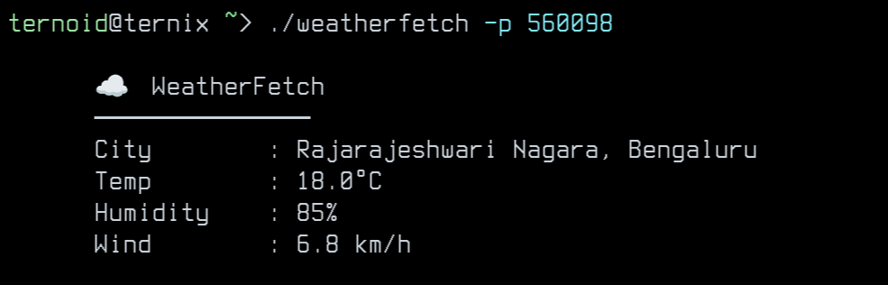

# 🌤️ weatherfetch

A simple, fast CLI tool to fetch current weather information directly in your terminal — inspired by tools like `neofetch` and `fastfetch`.

WeatherFetch focuses on **clarity, minimal output, and zero configuration**.

---

## ✨ Features

- Fetch current weather using **Indian pincode**
- Clean, minimal terminal output
- Temperature in **°C**
- Wind speed in **km/h**
- Built with Go

---

## 🖼️ Preview




---

## 📦 Installation

### Build from source

```bash
git clone https://github.com/Krish-jswl/weatherfetch.git
cd weatherfetch
go build ./cmd/weatherfetch
